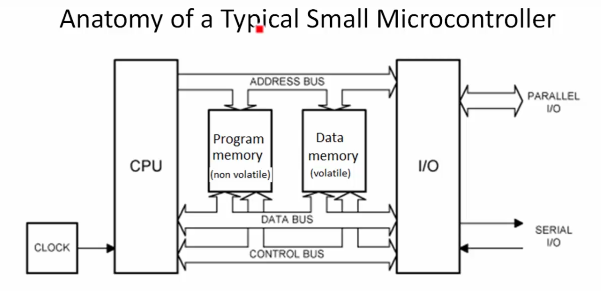
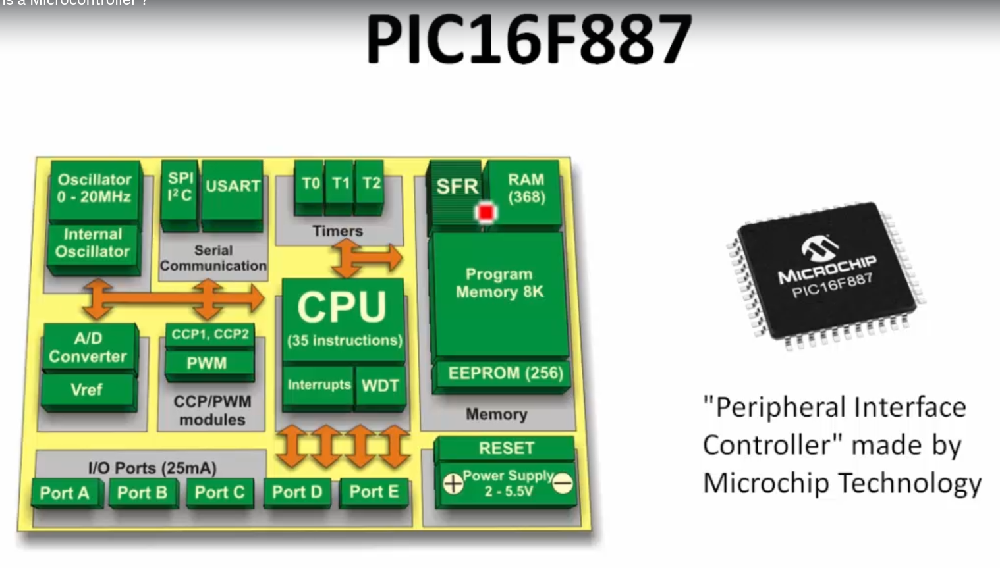
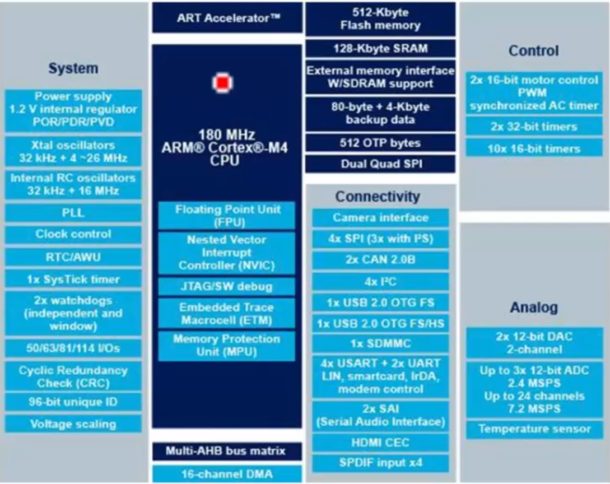
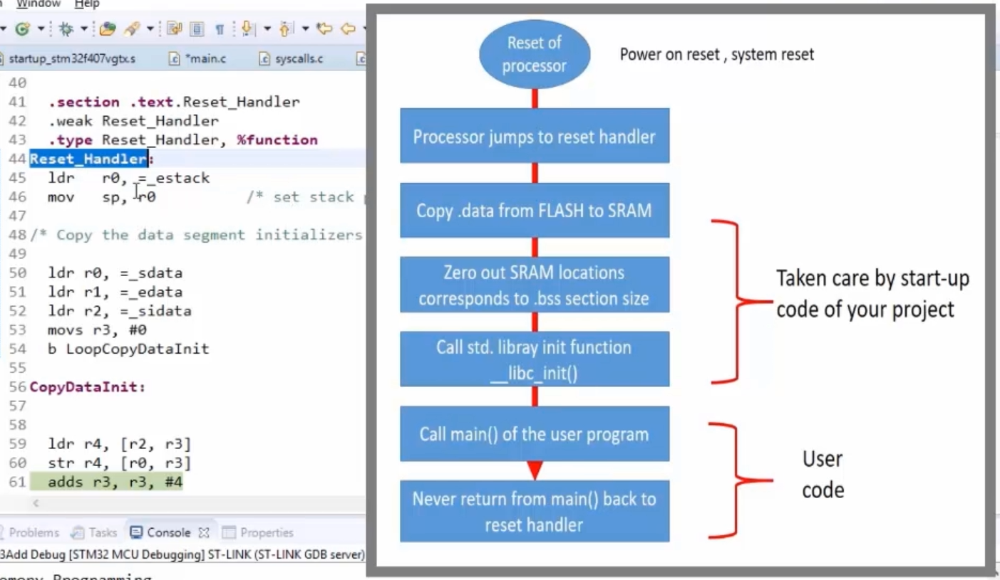
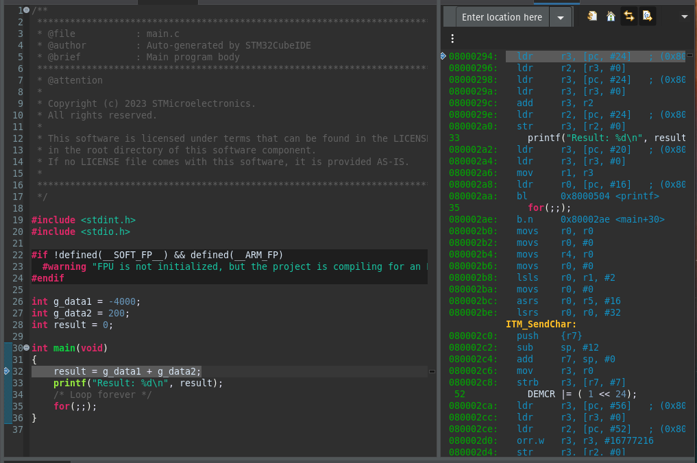

# What is a Microcontroller
A microcontroller (MCU) is a small computer system on a single chip.

## typical items on a MCU
- Processor
- volatile/non-volatile memory
  + SRAM
  + FLASH
  + ROM
  + EEPROM
- input/output (I/O) pins
- peripherals
  + ADC
  + DAC
  + Timers
  + UART
  + USB
- clock
- bus interface


## Anatomy of a MCU
- Program memory (uploaded program instructions) is non-volatile -> FLASH. Even if power is off, memory is persistant
- as soon as power is on, CPU reads instructions from Program memory, and executes them. 
- CPU speed depends on the clock 
- Data Memory is volatile -> SRAM. Data is consumed during Runtime. Therefore it doesn't need a non-volatile memory. 
- I/O Interface communicates with peripherals, like a bluetooth device
- There are different busses on a microcontroller:
  + Address bus (address of devices)
  + Data Bus (data transmission)
  + Control Bus






## Code Memory
- ROM (Read only memory)
  + MPROM (Mask programmable read only memory)
  + EPROM (Ultraviolet erasable programmable ROM)
  + EEPROM (Electricallly erasable programmable ROM)
- OTP (One time programmable)
- FLASH (also electically erasable)
- FRAM (ferroelectric random access memory)

## Read Memory Content
```console
# Display Content of section headers: -h
$ arm-none-eabi-objdump -h 003_memory-browser.elf

# here you can see the memory location of the data: 080014d4

003_memory-browser.elf:     file format elf32-littlearm

Sections:
Idx Name          Size      VMA       LMA       File off  Algn
  0 .isr_vector   000001a8  08000000  08000000  00010000  2**0
                  CONTENTS, ALLOC, LOAD, READONLY, DATA
  1 .text         00001278  080001b0  080001b0  000101b0  2**4
                  CONTENTS, ALLOC, LOAD, READONLY, CODE
  2 .rodata       000000a4  08001428  08001428  00011428  2**2
                  CONTENTS, ALLOC, LOAD, READONLY, DATA
  3 .ARM.extab    00000000  080014cc  080014cc  0002006c  2**0
                  CONTENTS
  4 .ARM          00000000  080014cc  080014cc  0002006c  2**0
                  CONTENTS
  5 .preinit_array 00000000  080014cc  080014cc  0002006c  2**0
                  CONTENTS, ALLOC, LOAD, DATA
  6 .init_array   00000004  080014cc  080014cc  000114cc  2**2
                  CONTENTS, ALLOC, LOAD, DATA
  7 .fini_array   00000004  080014d0  080014d0  000114d0  2**2
                  CONTENTS, ALLOC, LOAD, DATA
  8 .data         0000006c  20000000  080014d4  00020000  2**2
                  CONTENTS, ALLOC, LOAD, DATA
```
- .text: stores all the programm codes of the programm.
- -rodata: stores the readonly data of the programm.
- VMA: Virtual Memory Address (Destination in SRAM): -> where the section should finally be copied to.
- LMA: Load Memory Address (Source in FLASH): -> where the section is actually loaded.
<br>
-----
<br>
## Data address from .data is pasted into the browser
You can see, that the value of the variables is found in LMA memory.<br> 
Even the position in the VMA can be found.


<br>
---
<br>
<br>

## reset_handler in startup file:
written in assembly. <br>
reset_handler is the first function after reset/power on. <br>
copies data from FLASH to SRAM



<br>
---
<br>
<br>


## Disassembly
It is possible to translate the compliled code to assembly code.
```console
# show disassmbled code in terminal
$ arm-none-eabi-objdump -d 003_memory-browser.elf

# sample output: 
# every line is 4 byte (second column). Translated to assembly on third column

08001410 <_init>:
 8001410:	b5f8      	push	{r3, r4, r5, r6, r7, lr}
 8001412:	bf00      	nop
 8001414:	bcf8      	pop	{r3, r4, r5, r6, r7}
 8001416:	bc08      	pop	{r3}
 8001418:	469e      	mov	lr, r3
 800141a:	4770      	bx	lr

0800141c <_fini>:
 800141c:	b5f8      	push	{r3, r4, r5, r6, r7, lr}
 800141e:	bf00      	nop
 8001420:	bcf8      	pop	{r3, r4, r5, r6, r7}
 8001422:	bc08      	pop	{r3}
 8001424:	469e      	mov	lr, r3
 8001426:	4770      	bx	lr
 ```

<br>

***its also possible to view this in the IDE.*** <br>
Go to "Window/Show View/Disassembly <br>
-> added breakpoints to the code, are marked in disassembler



<br>
---
<br>
<br>

## Format specifiers in C
Format Specifier | Type
---|--------------------
%c | Character
%d | Signed integer
%e or %E | Scientific notation of floats
%f | Float values
%g | or %G	Similar as %e or %E
%hi | Signed integer (short)
%hu | Unsigned Integer (short)
%i | Unsigned integer
%l or %ld or %li | Long
%lf | Double
%Lf | Long double
%lu | Unsigned int or unsigned long
%lli or %lld | Long long
%llu | Unsigned long long
%o | Octal representation
%p | Pointer
%s | String
%u | Unsigned int
%x or %X | Hexadecimal representation
%n | Prints nothing
%% | Prints % character

<br>

### Precision and size of floats and doubles

Datatype | Storage Size | Precision | Value Range
---------|--------------|-----------|------------
float | 4 bytes | up to 6 decimals | 1.2x10³⁸ to 3.4x10³⁸
double | 8 bytes | up to 15 decimals | 2.3x10⁻³⁰⁸ to 1.7x10³⁰⁸